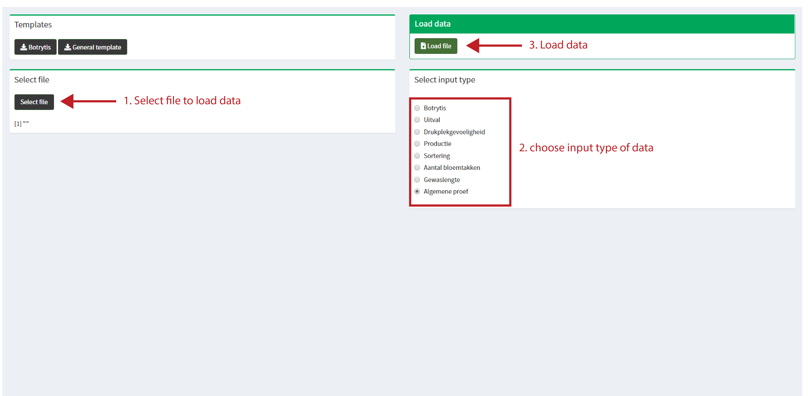

```{r setup, include=FALSE}
knitr::opts_chunk$set(echo = FALSE,  dev = "cairo_pdf")
```

# Introduction

Proefcentrum Hoogstraten vzw. (Belgium) is a research company specialized in greenhouse field trials and practical research for three crops: strawberry, sweet pepper and tomato. In order to ensure the quality of the research conclusions and repeatability a standardised statistical analysis tool was developed as a R-Shiny web application. With this Shiny application researchers of Proefcentrum Hoogstraten are able to perform frequently used analysis on their data. 

This manual helps researchers to use the application as intended. For further questions or inquiries please contact me directly dieterbaets(at)gmail(dot)com or dieter(dot)baets(at)proefcentrum(dot)be.


# Install requirements
Before running the Shiny application on your own machine please ensure following prerequisites:

* at least R-version 4.0.0 (Arbor Day) or higher
* at least RStudio 1.2.5033 (Orange Blossom) or higher

First install the correct R-version on your own machine befor installing R-Studio. This ensures that alle R-related documents are recognised by RStudio as an IDE. After installing the software download the code on the github repo ( [github.com/dbaets/PCH_StatisticalApplicaton](https://github.com/dbaets/PCH_StatisticalApplication) ). Unzip the code in a folder of your own choosing, best to keep it on your own c:// harddrive for example under documents.
Look for install folder and open the *install.Rproj* file. In this R project open the *R_installpackages.R* file and run the script by selecting the entire code and clicking on *Run* in the right top corner of the scripts pane. Wait untill all necessairy applicatons are installed.


# Running Shiny application
After installing all the required packages you can now run the shiny application. Open the *statisticalapp* folder and open the *PCH_statisticalApplication.Rproj* file. By doing so you are ensuring that all necessairy scripts for the application are located in the right place so the app can run smoothly. Open the *app.R* file and click on **Run App** in the right upper corner of the scripting pane. If all goes well you are now officially running the *PCH - Statistical application* and you can perform the necessary statistial analasys.


# Performing statistical analysis using statistical application
## Preparing data
In order to perform any analys using the *PCH - statistical application* you need to put the data in to the correct format otherwise the shiny app cannot load the data and will throw an error. Please download the correct template f

## Loading data
First select a input file using the **Select file** button and select an input type using the radiobuttons on the *Input* pane before loading the file using the **Load file** button.



## Running analysis
When de data is loaded correctly in to the application you are automatically taken to the next pane called *statistics*.
On this pane you only have to press the green button *Run Statistics*.
If everything goes well you are redirected to the *output* pane where you can download the results using the green *Output Results button*.
The output excel is redirected to the same folder were you loaded the inputdata from.

If the app jumps automatically to the next pane the analysis went without errors.


## Interpreting output
## output file
following tabs are generated in the outputfile:

* **inputdata**: the inputdata used to perform the analysis
* **teststatistic**: summary of the test statistic used to differentiate between different objects. The app chooses automatically between parametric and non parametric tests according to the prerequisites for each tests.
* **sigletters**: if the p-value of the test statistic is <0.05 you can interpret the results using a post-hoc test. For each object a letter or p-value is placed in a table with the summary statistics. If the letters are different from each other the different objects are different from each other.
* **summary**: table with a summary of the data. This summary is ideal to make graphs from.

## reporting results
todo

# Types of inputdata

## Botrytis

excelsheetname: *statistiek*


## productie

excelsheetname: *statistiek_productie*


## sortering

excelsheetname: *statistiek_sortering*

